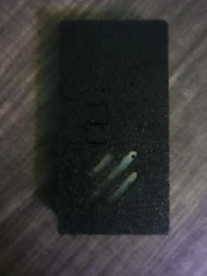

# 🤖 CLAW: MimiClaw

**Pocket AI assistant board — pre-flashed ESP32-S3**

**CLAW: MimiClaw** is a pre-flashed pocket AI assistant board from P01yg107 Labs, built on the ESP32-S3. It arrives ready to run out of the box — plug it in and go. A compact, hackable base for tinkering with on-device assistants.

🛒 **Buy one:** https://p01ylabs.com  ·  🏷️ **$50.00**

> ⚠️ **For education and authorized testing only.** See [docs/SAFETY.md](docs/SAFETY.md).

---

## Specs

| | |
|---|---|
| Board | ESP32-S3 |
| State | Pre-flashed, ready out of the box |
| Interface | USB serial (115200 baud) [confirm] |
| Case | 3D-printed PETG-CF with a flush two-colour emblem |

## Quick start

1. Plug the MimiClaw into a USB port with a data cable.
2. Give it a few seconds to boot.
3. Open a serial console at 115200 baud to interact [confirm].
4. See docs/USAGE.md for what it can do.

Full walkthrough: **[docs/SETUP.md](docs/SETUP.md)** · Usage & examples: **[docs/USAGE.md](docs/USAGE.md)** · Problems: **[docs/TROUBLESHOOTING.md](docs/TROUBLESHOOTING.md)**

## Firmware & credits

_This device's firmware/software is built in-house by P01yg107 Labs._

This repo is the product documentation and companion material. Where upstream firmware is
used, please support and star the upstream project; firmware issues belong upstream.

## About P01yg107 Labs

Hand-built hardware for people learning offensive security. Every device is flashed and
bench-tested before it ships.

🌐 https://p01ylabs.com  ·  🐙 https://github.com/p0lygl07

---

© 2026 Joshua Burton (P01yg107 Labs). Documentation and original files licensed under the MIT License (see [LICENSE](LICENSE)).
Any upstream firmware remains the property of its respective authors, under their own licenses.
